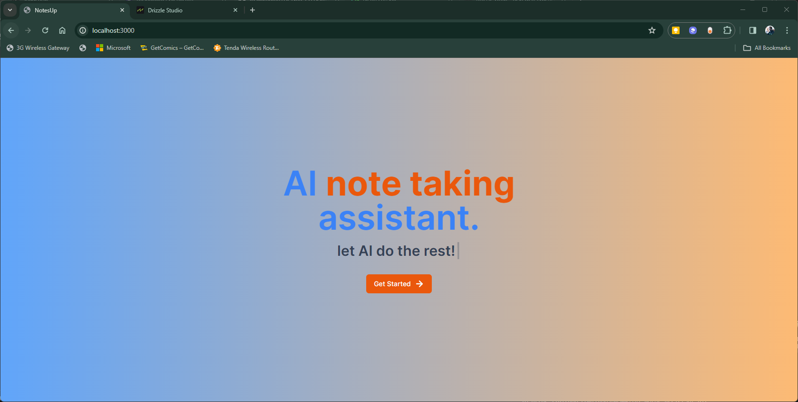

notesup is a web app the puts artificial intelligence at the forefront of note taking. It uses the latest in machine learning to provide a seamless note taking experience. It is built with Next.js, Tailwind CSS, and TypeScript.

THE INTERFACE ⬇️⬇️⬇️


support the developer by buying me a coffee ☕ at https://www.buymeacoffee.com/fredjuma

## to run the code locally
First, clone the repository:

```bash
git clone
```

Then, install the dependencies:

```bash
npm install
# or
yarn
# or
pnpm
# or
bun
```

Finally,
Then run the development server:

```bash
npm run dev
# or
yarn dev
# or
pnpm dev
# or
bun dev
```
